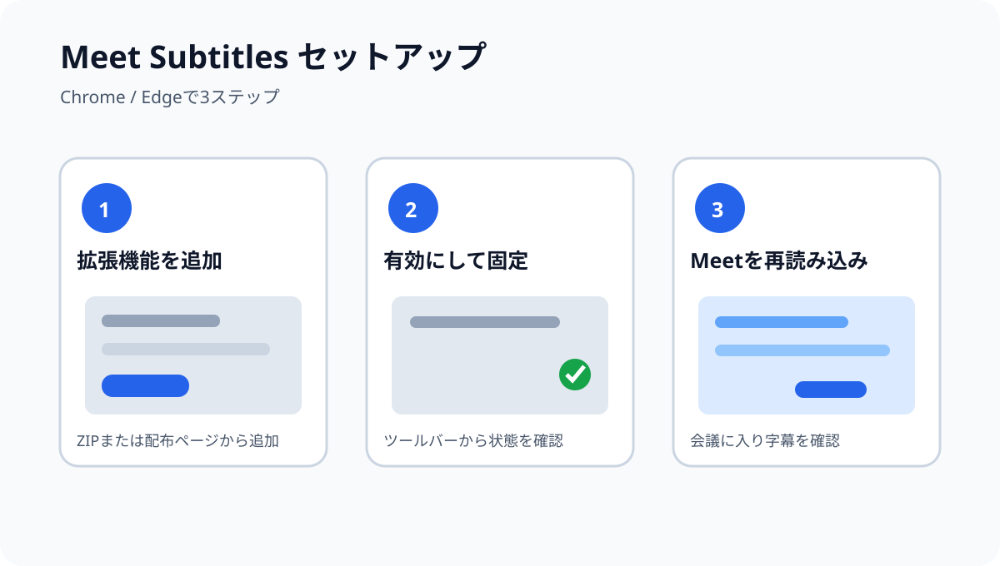
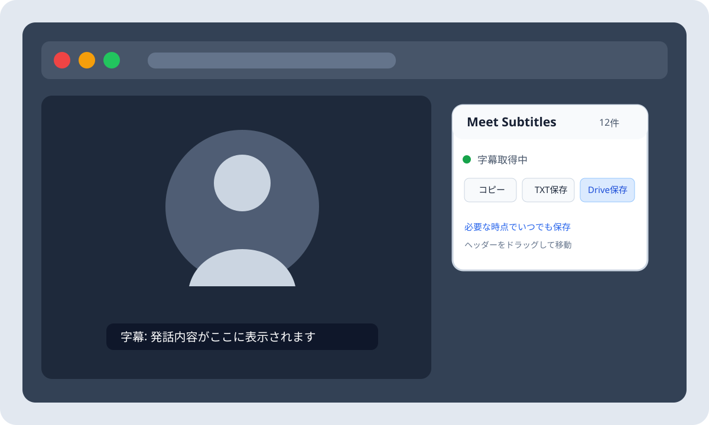

# Meet Subtitles

Google Meetの字幕を会議中に残し、必要な時点でコピー・TXT保存できるブラウザ拡張機能です。会議終了時には、字幕をGoogle Driveの `Meet Subtitles` フォルダへ自動保存します。

## できること

- Meetへ入室すると字幕を自動でONにする
- 会議中の字幕を話者ごとに保存する
- Meet画面内のパネルから、いつでもコピー・TXT保存する
- パネルを折りたたむ、好きな位置へ移動する
- 会議終了時にGoogle Driveへ自動保存する

## セットアップ

### Chrome / Edgeへの追加

1. 配布ページから拡張機能をインストールします。
2. ブラウザの拡張機能一覧で `Meet Subtitles` を有効にします。
3. Meetを開く前に、拡張機能をツールバーへ固定しておくと状態を確認しやすくなります。
4. `meet.google.com` のページを再読み込みします。



> 現在は配布版の準備中です。配布版がない場合は、GitHub Releasesに掲載されたZIPを展開し、ブラウザの拡張機能管理画面から「展開して読み込む」を選択してください。

### Google Drive保存の初回設定

Google Meetへのログインだけでは、拡張機能がGoogle Driveへ書き込む権限は付与されません。初めて `Drive接続` または `Drive保存` を行うときにGoogleの認証画面が表示されるため、保存先と権限を確認して許可してください。

会議に入室した後、Meet Subtitlesパネルの `Drive接続` を押してOAuthを実行できます。字幕本文は送信されず、認証だけが行われます。認証後はボタンが `Drive保存` に変わります。

配布版では必要な認証設定が済んでいます。自分で作成した版で認証設定エラーが表示される場合は、配布元の設定を確認してください。

認証後に作成されるファイルは、マイドライブ直下の次のフォルダに保存されます。

```text
マイドライブ / Meet Subtitles / meet-subtitles-YYYY-MM-DD-HHmmss.txt
```

## 使い方

1. Google Meetの待機画面から会議に入室します。
2. 入室後、画面内に `Meet Subtitles` パネルが表示され、字幕が自動でONになります。
3. 初回はパネルの `Drive接続` を押し、Googleの認証画面で許可します。
4. 会議中は字幕が自動的に蓄積されます。パネルには保存件数が表示されます。
5. 必要な時点で `コピー` または `TXT保存` を押します。
6. パネルを小さくしたいときは、右上の `−` を押します。ヘッダーをドラッグすると位置を移動できます。右下のリサイズハンドルをドラッグすると幅・高さを変更できます。
7. Drive認証済みの場合、退出・会議終了・Meetページからの遷移時に字幕がGoogle Driveへ保存されます。



字幕は次の形式で保存されます。

```text
[00:01:23] 話者名
発話内容
```

## 保存とプライバシー

- 字幕は会議中、ブラウザ内のIndexedDBに保存されます。
- Google Drive保存を実行したときだけ、字幕TXTがGoogle Driveへ送信されます。
- 字幕を広告・分析・AI学習などの目的で外部サービスへ送信しません。
- Driveへ保存されるファイルは、拡張機能が作成する `Meet Subtitles` フォルダ内のTXTファイルです。
- 会議参加者への字幕保存について、所属組織や会議のルールを確認してください。

## うまく動かないとき

### パネルが表示されない

Meetページを再読み込みし、会議に入室済みか、拡張機能が有効になっているか確認してください。パネルは `meet.google.com/home` や入室前の待機画面には表示されません。

### 字幕が取得されない

Meet本体の字幕がONになっているか確認してください。字幕ボタンが表示されるまで少し待っても取得されない場合は、Meetページを再読み込みしてください。

### Google Driveへ保存されない

初回の `Drive接続` または `Drive保存` でGoogleの認証を許可したか確認してください。認証や通信に失敗しても、字幕はブラウザ内に残るため、会議終了後に再度 `Drive保存` を実行できます。

### タブを切り替えたら保存処理が始まらない

タブ切り替えだけでは会議終了と判断しません。会議から退出するか、Meetページを離れてください。

## 対応ブラウザ

Chrome、Edgeを中心としたChromium系ブラウザを対象にしています。Chromium系ブラウザでも、Google OAuthや拡張機能APIの対応状況によってDrive保存が利用できない場合があります。
